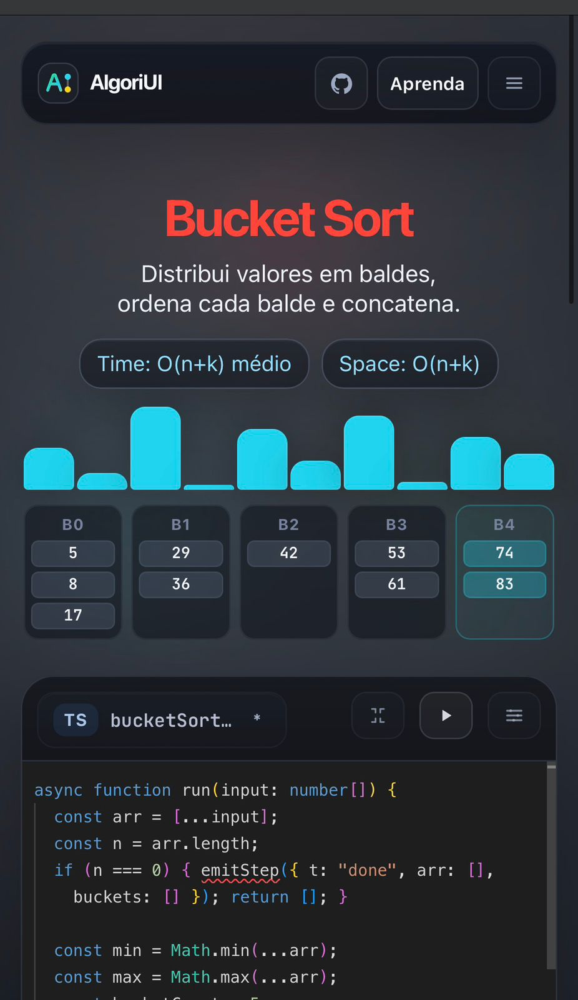
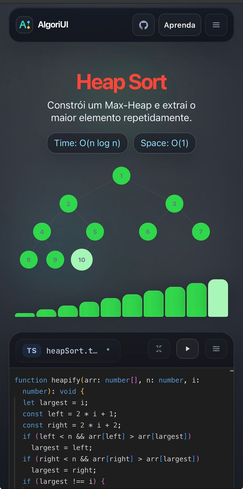

# AlgoriUI

> **[PT-BR]** Visualizador interativo de algoritmos — escreva código em TypeScript, JavaScript ou Python e assista à animação em tempo real.
>
> **[EN]** Interactive algorithm visualizer — write code in TypeScript, JavaScript or Python and watch the animation in real time.

---

## Screenshots

| Aprenda | Bucket Sort | Heap Sort |
|---------|-------------|-----------|
|  |  |  |

---

## Stack

- Next.js 15 (App Router)
- React + TypeScript
- Monaco Editor
- Framer Motion
- Zustand
- Pyodide (Python runner in-browser)

---

## Funcionalidades / Features

**PT-BR**

- Editor com troca de linguagem (TS/JS/Python)
- Algoritmos prontos: Bubble Sort, Cocktail Sort, Selection Sort, Heap Sort, Bucket Sort, Radix Sort, Stalin Sort, BFS, DFS
- Visualizações: barras, heap tree, grid de labirinto, buckets
- Timeline de eventos com play/pause/step/scrub
- Efeitos sonoros reativos com toggle e volume
- Página `/aprenda` com mini-visualizadores e explicações
- i18n PT/EN
- Persistência local
- Compartilhamento por URL comprimida

**EN**

- Editor with language switching (TS/JS/Python)
- Built-in algorithms: Bubble Sort, Cocktail Sort, Selection Sort, Heap Sort, Bucket Sort, Radix Sort, Stalin Sort, BFS, DFS
- Visualizations: bars, heap tree, maze grid, buckets
- Event timeline with play/pause/step/scrub
- Reactive sound effects with toggle and volume
- `/aprenda` page with mini-visualizers and explanations
- i18n PT/EN
- Local persistence
- Sharing via compressed URL

---

## Quick Start

```bash
curl -sL https://raw.githubusercontent.com/albavxs/AlgoriUI/main/setup.sh | bash
```

Ou manualmente / Or manually:

```bash
git clone https://github.com/albavxs/AlgoriUI.git
cd AlgoriUI
npm install
npm run dev
```

Abra / Open `http://localhost:3000`.

## Build de produção / Production build

```bash
npm run build
npm run start
```

---

## Créditos / Credits

Alguns algoritmos apresentados neste projeto são baseados no livro:
Some algorithms featured in this project are based on the book:

> **Entendendo Algoritmos: Um guia ilustrado para programadores e outros curiosos**
> *Grokking Algorithms: An Illustrated Guide for Programmers and Other Curious People*
> Aditya Y. Bhargava — Novatec Editora

---

## Licença / License

AGPL-3.0 — veja / see [LICENSE](./LICENSE).

Este software é licenciado sob a GNU Affero General Public License v3.0.
Qualquer pessoa que modificar e disponibilizar publicamente (inclusive via rede/web) é obrigada a liberar o código-fonte das modificações sob a mesma licença.

This software is licensed under the GNU Affero General Public License v3.0.
Anyone who modifies and makes it publicly available (including over a network) is required to release the source code of their modifications under the same license.
